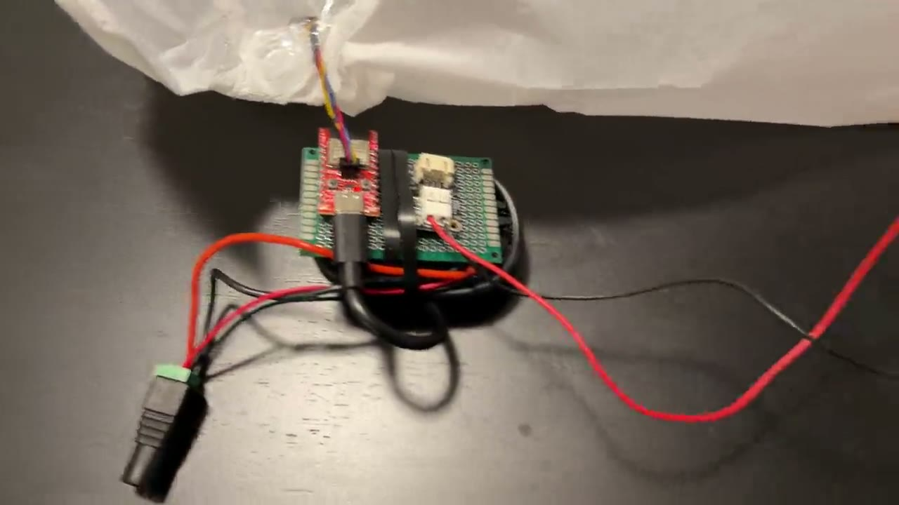

# Costume Dynamic Pressure Fan

Closed-loop blower controller for an inflatable costume. An **ESP32-C3** reads
air pressure from a barometric sensor and drives a **12 V blower** through a
MOSFET, holding the suit at a constant, configurable overpressure above ambient
— so it stays firm whether the wearer is sitting still or walking around, and
whether the weather or altitude shifts. Live telemetry streams over **Bluetooth
LE** to a phone for tuning.

Originally built to inflate the "Graboid" costume; the firmware is generic and
works for any single-blower inflatable.

> **Status:** working on real hardware. Pressure sensing, PI fan control, and
> BLE telemetry are all functional.

## Demo

[](docs/demo.mp4)

*Click the image to play ([docs/demo.mp4](docs/demo.mp4)).*

---

## How it works

```
   USB 5V ──── or ────► VBUS ◄──── 5V ──── Buck ◄──── 12V supply ─┐
                          │                                        │
                     ┌────┴─────────────────┐                      │
                     │  SparkFun Pro Micro  │                      │
                     │       ESP32-C3       │                      │
                     │                      │                      │
              Qwiic ─┤ GPIO5/6  (I2C)       │       ┌────────────┐ │
                     │                      │ ─────►│ Adafruit   │ │
                     │ GPIO7   (PWM 1 kHz)  │       │ MOSFET     │◄┤
                     │ GPIO10  (status LED) │       │ PID 5648   │ │
                     │ GND ───── common GND │       │            │ │
                     └──────────────────────┘       └─────┬──────┘ │
                              │                            │ switched GND
                              │                            ▼       │
                     ┌────────┴────────┐              ┌────────┐   │
                     │   Adafruit      │              │ Delta  │◄──┘
                     │   LPS22         │◄── ambient ──│ BFB1012│
                     │   pressure      │              │ VH-AF00│
                     │   sensor        │              │ blower │
                     └─────────────────┘              └────────┘
```

1. **Sense** — at boot, with the fan off, the firmware samples ambient pressure
   as a *baseline*, then targets `baseline + 2.0 hPa` (configurable). The target
   is relative so the suit holds the same *inflation* even as weather/altitude
   change.
2. **Actuate** — a low-side N-MOSFET switches the 12 V blower; speed is set by
   1 kHz PWM.
3. **Control** — a PI loop with a "boost to target, then hold" structure keeps
   pressure on target. If the sensor read ever fails, the fan is cut to 0 (safe).
4. **Telemetry** — the board advertises over BLE as `graboid-01` and streams a
   CSV line (`target, measured, duty%, temp`) you can watch live in Adafruit
   Bluefruit Connect's Plotter.

For the full design rationale (control math, PWM-frequency choice, gotchas, and
upgrade paths), see **[docs/DESIGN.md](docs/DESIGN.md)**.

---

## Parts list

| Component | Part / link | Role |
|-----------|-------------|------|
| MCU board | [SparkFun Pro Micro ESP32-C3](https://www.sparkfun.com/sparkfun-pro-micro-esp32-c3.html) (DEV-21925) | Reads sensor, runs control loop, BLE |
| Pressure sensor | [Adafruit LPS22 — STEMMA QT / Qwiic](https://www.adafruit.com/product/4633) (PID 4633) | Barometric pressure over I²C |
| Fan driver | [Adafruit MOSFET Driver](https://www.adafruit.com/product/5648) (PID 5648) | Low-side N-MOSFET switch for the blower |
| Blower | [Delta BFB1012VH-AF00](docs/BFB1012VH-AF00.pdf) (12 V DC blower) | The fan that inflates the suit ([datasheet](docs/BFB1012VH-AF00.pdf)) |
| I²C cable | [SparkFun Qwiic cable](https://www.sparkfun.com/products/14427) / [Adafruit STEMMA QT](https://www.adafruit.com/product/4399) | ESP32 ↔ LPS22 (plug-and-play) |
| 12 V supply | Any 12 V DC, **≥ 2 A** | Powers the blower |
| 12 V→5 V buck *(optional)* | Any 5 V output, ≥ 500 mA | Run the ESP32-C3 off the same 12 V rail (untethered) |

The blower draws ~1.5 A typical / 1.8 A max — right at the MOSFET breakout's
1.5 A continuous rating, so size the 12 V supply with margin and watch the
breakout temperature under sustained full-speed operation. See
[docs/DESIGN.md §8](docs/DESIGN.md) and the driver-upgrade appendix if you want
more headroom.

---

## Wiring

### Pin map

| Pin | Role | Connects to |
|-----|------|-------------|
| GPIO5 | I²C SDA | LPS22 SDA (via Qwiic) |
| GPIO6 | I²C SCL | LPS22 SCL (via Qwiic) |
| GPIO7 | Fan PWM | MOSFET driver `In` (signal) |
| GPIO10 | Status LED | on-board STAT LED (heartbeat) |

> **Note:** On the SparkFun Pro Micro ESP32-C3 the Qwiic connector is wired to
> **GPIO5/6**, *not* the GPIO8/9 you'll see in generic ESP32-C3 tutorials.

### 1. Pressure sensor (Qwiic — plug-and-play)

Plug a Qwiic / STEMMA QT cable from the board's Qwiic connector into either
connector on the LPS22 breakout. That carries power, ground, SDA (GPIO5), and
SCL (GPIO6) in one cable. The breakout has onboard pull-ups; nothing else to do.
Default I²C address is `0x5D`.

### 2. Fan + MOSFET driver

The Adafruit driver is a **low-side switch**: it makes/breaks the fan's *ground*.

```
   12V supply (+) ───────────────► V+   (driver input)
   12V supply (–) ──┬────────────► GND  (driver input)
                    └────────────► ESP32-C3 GND     ← common ground, REQUIRED
   ESP32-C3 GPIO7 ──────────────► In   (driver input)

   Fan RED  (+12V) ─────────────► "+"      output screw terminal
   Fan BLACK (–)   ─────────────► "–"/Out  output screw terminal
   Fan BLUE (tach) ─────────────► (leave disconnected — reserved for future RPM)
```

**The common ground is mandatory.** With the ESP on USB and the fan on a 12 V
brick, the two grounds must be tied together or the MOSFET gate has no reference
and won't switch. The driver's green `ON` LED shows power; the red `Sig` LED
pulses with PWM duty.

### 3. Powering the ESP32-C3 (two options)

- **Tethered (development):** USB-C powers the board; the 12 V brick only feeds
  the fan. Grounds still common (above).
- **Untethered (in-costume):** drop the 12 V rail to 5 V with a buck converter
  and feed the board's **`VBUS`** pin (its RT9080 regulator accepts up to 5.5 V).
  Connect 5 V → `VBUS`, ground → `GND`. **Never feed 5 V into `3V3`/`VCC`** —
  that's the regulator's output and 5 V there will destroy the chip.

> `VBUS` is tied directly to the USB 5 V with no isolation diode on this board.
> Don't power `VBUS` externally *and* plug in USB at the same time — pick one
> source, or you'll back-feed your laptop's USB port.

---

## Install & flash

### Prerequisites

- **ESP-IDF v6.0+** ([install guide](https://docs.espressif.com/projects/esp-idf/en/latest/esp32c3/get-started/)).
  Built and tested against v6.0.1.
- The SparkFun Pro Micro ESP32-C3 flashes over its **native USB Serial/JTAG** —
  no external USB-UART adapter and no DTR/RTS reset trick needed.

### Command line (recommended)

```bash
# 1. Load the ESP-IDF environment (once per shell)
#    Linux/macOS:
. $HOME/esp/esp-idf/export.sh
#    Windows PowerShell (adjust path to your install):
#    . C:\Espressif\tools\Microsoft.<version>.PowerShell_profile.ps1

# 2. From the firmware/ directory:
cd firmware
idf.py set-target esp32c3      # first time only
idf.py build
idf.py -p <PORT> flash monitor # PORT = COM3 (Windows) or /dev/ttyACM0 (Linux)
```

Exit the monitor with `Ctrl+]`.

> **Flashing tip:** close any open serial monitor before flashing — the port can
> only be owned by one process at a time. A flash that hangs at `Connecting....`
> is almost always the monitor still holding the port, or the board mid-reset.
> If it won't connect, hold **BOOT**, tap **RESET**, release **BOOT**, then flash.

### VS Code (ESP-IDF extension)

Open the **`firmware/`** folder (not the repo root — the extension needs the
`CMakeLists.txt` at the opened folder's root). Set target to `esp32c3`, pick the
**built-in USB-JTAG** flash method, then use the Build / Flash / Monitor buttons
in the status bar.

### First run

With **nothing** plugged into Qwiic, the board boots, advertises over BLE, holds
the fan at 0, and logs `LPS22 not responding ... Retrying` once a second — it
will **not** crash-loop. Plug in the LPS22 and it auto-detects within a second,
samples its baseline, and enters the control loop. Keep the sensor at ambient
(suit not sealed) during the first second so the baseline is clean.

---

## Usage & telemetry

The serial monitor prints one line per control iteration:

```
P=1015.05 hPa  err=+0.16  duty=68%  T=24.5C
```

Over BLE, the board advertises as **`graboid-01`** and exposes the **Nordic UART
Service (NUS)**. Each iteration it sends one CSV line on the TX characteristic:

```
target_hpa,measured_hpa,duty_pct,temp_c
e.g.  1017.21,1016.98,72.5,24.5
```

Install **[Adafruit Bluefruit Connect](https://learn.adafruit.com/bluefruit-le-connect)**
(free, iOS/Android), connect to `graboid-01`, and open the **Plotter** to watch
target / measured / duty / temperature live. Any generic BLE tool (nRF Toolbox,
LightBlue) works too, since NUS is universally supported.

---

## Tuning

All tuning knobs are `#define`s at the top of
[`firmware/main/main.c`](firmware/main/main.c) — no need to dig through code:

| Knob | Default | Effect |
|------|---------|--------|
| `TARGET_OVERPRESSURE_HPA` | 2.0 | Inflation set-point above ambient baseline |
| `BOOST_BAND_HPA` | 0.5 | More than this below target → run full speed |
| `DUTY_FEEDFORWARD` | 0.55 | Starting guess for the "hold" duty |
| `KP` | 0.50 | Proportional gain (duty per hPa) |
| `KI` | 0.20 | Integral gain (duty per hPa·s) |
| `DUTY_MIN` | 0.30 | Stall floor — fans won't spin reliably below this |
| `DUTY_MAX` | 1.00 | Ceiling (lower it if the MOSFET runs hot) |
| `FAN_PWM_FREQ_HZ` | 1000 | PWM frequency (see DESIGN.md for why 1 kHz) |

Quick diagnosis:

| Symptom | Fix |
|---------|-----|
| Duty oscillates fast | Lower `KP`, then `KI` |
| Pressure sags below target | Raise `KI`; confirm `DUTY_MAX = 1.0` |
| Fan won't spin at low duty | Raise `DUTY_MIN` |
| Pressure never climbs even at 100% | Tighten seals; check fan polarity |
| Status LED frozen | I²C/sensor failure — check Qwiic cable & `0x5D` |
| MOSFET breakout hot at 100% | Lower `DUTY_MAX` or upgrade the driver |

Full tuning and troubleshooting tables are in
[docs/DESIGN.md §10](docs/DESIGN.md).

---

## Repository layout

```
costume-dynamic-pressure-fan/
├── README.md                 this file
├── README.html               standalone HTML version
├── LICENSE                   MIT
├── docs/
│   ├── DESIGN.md             full system design & rationale
│   └── BFB1012VH-AF00.pdf    blower datasheet
└── firmware/                 ESP-IDF project (open THIS folder in VS Code)
    ├── CMakeLists.txt
    ├── sdkconfig.defaults    target, USB-JTAG console, NimBLE config
    └── main/
        ├── CMakeLists.txt
        ├── main.c            sensor + PWM + PI control + telemetry
        ├── ble_nus.c         NimBLE Nordic UART Service server
        └── ble_nus.h
```

---

## Safety notes

- **Common ground** between the 12 V and ESP power domains is required.
- The blower current is close to the MOSFET breakout's continuous rating — watch
  for heat under sustained full-speed operation; lower `DUTY_MAX` or upgrade the
  driver if needed.
- The blower's max static pressure is **4.86 hPa**; targeting above that will
  just stall the fan against the backpressure. The default 2.0 hPa leaves margin.
- Fit a fan guard and observe the blower's polarity (reverse polarity can damage
  it — see the datasheet's application notes).

## License

MIT — see [LICENSE](LICENSE).
